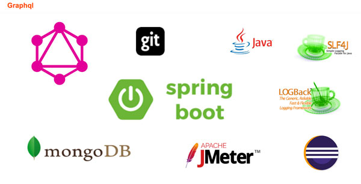

# POC Graphql


## Stack tecnológico:

```
  Spring Boot + MongoDB + Graphql + Logback
```




Para la integración con Graphql he estado mirando varios frameworks diferentes que faciliten la integración entre ellos y fácil implementación. Algunas de los argumentos para desechar muchos de ellos serían:


  - Declaración de esquema muy "verboso". Declarar un schema de Graphql en Java es poco natural aun usando frameworks que lo facilitan con anotaciones, la declaración pasa a ser compleja ,tediosa, nada reutilizable ... y sobre todo sobre un entorno fácil de cometer errores. ([Spring common](https://github.com/oembedler/spring-graphql-common) ...)


  - Los que se refieren a código generado (Schema First), algunos no soportan tipos básicos, otros obligan a generarte tu mismo los pojos [Graphql tools](https://github.com/graphql-java/graphql-java-tools) aunque sí ofrecen parseo de esquema ...


  - En el caso de la integración con Spring-JPA creo que es demasiado rígida en cuanto a la filosofía de Graphql y se asume que schema = modelo, y bajo
  dicha premisa sería mejor usar un Spring Data Rest


  - Por último otros cuantos acusan la falta de documentación y pocas actualizaciones del repo ..


## Frameworks utilizados:

- [Graphql para java](https://github.com/graphql-java/graphql-java)
- [Graphql-apigen] (https://github.com/Distelli/graphql-apigen) 
      
      
	Filosofía Schema first :
	- Genera todos los POJOS (Input, Entidades …) 
	- Permite estructuración en paquetes de un modo sencillo
	- Genera armazón de clases para la inclusión nuestra programación, y es extensible, usa intefaces para todo.
	- Genera clases @fluent
	- Integración básica con Guice y Spring
	- Plugin de maven de generación de los fuentes "mvn clean compile" 

- [Graphql-Spring-Boot](https://github.com/graphql-java/graphql-spring-boot) , este es el oficial , no obstante existe una aproximación muy buena también que sería
     [Spring Boot starter Graphql](https://github.com/merapar/spring-boot-starter-graphql)

	- Se usa configuración por convención
	- Implementa la exposición mediante endpoint Http del Graphql Server completa
	- Permite varias opciones de configuración, entre ellas las estrategias de ejecución de consultas, prefijos de los roles de los objetos ...
	- Incluye herramienta oficial para consultas [Graphiql] (https://github.com/graphql/graphiql), accesible desde el navegador para la construcción de consultas y mutaciones.


## Requisitos

Java 1.8
Maven 3.x
MongoDB 3.X

## Construcción

```
mvn clean compile
```

## Ejecución

```
java -jar target/poc-grapql-api-gen-fat.jar o mejor sh build_and_run.sh
```

```
sh build_and_run.sh


## Esquema

Accede tu mismo al [editor de consultas](http://localhost:8080/) del proyecto, o emplea si deseas [uno externo](https://lucasconstantino.github.io/graphiql-online/)


```graphql
# Coche
type Car @java(package:"com.paradigma.graphql.schema.car.car") {
    id: String! # ! significa obligatorio
    model: Model!
    color: String
    
}

# Root query
type QueryRoot @java(package:"com.paradigma.graphql.schema.car.root.query") {
    cars: [Car] # Listado de los coches
    car(id: String!): Car # Coche por id 
    models(id: String): [Model] # Listado de los modelos
    model(id: String!): Model # Model por id 
    brands(id: String): [Brand] # Listado de las marcas
    brand(id: String!): Brand # Marca por id 
}

# Modelo
type Model @java(package:"com.paradigma.graphql.schema.car.model") {
    id: String!
    name: String
    brand: Brand!
    year: Int
}

# Modelo
type ModelQuery @java(package:"com.paradigma.graphql.schema.car.model") {
    models(id: String): [Model] # Listado de los modelos
    model(id: String!): Model # Model por id 
}


# Brand
type BrandQuery @java(package:"com.paradigma.graphql.schema.car.brand") {
    brands(id: String): [Brand] # Listado de las marcas
    brand(id: String!): Brand # Marca por id 
}


# Marca
type Brand @java(package:"com.paradigma.graphql.schema.car.brand") {
    id: String!
    name: String
}

# Objeto de entrada para agrupar las propiedades de un coche y crearlo
input InputCreateCar @java(package:"com.paradigma.graphql.schema.car.car.create") {
    modelId: String!
    color: String!
}

# Operaciones sobre los coches:
type MutateCars @java(package:"com.paradigma.graphql.schema.car.car") {
     createCar(car:InputCreateCar): Car
     deleteCar(id: String!): String
}


```

Ejemplos de consultas:

```graphql

{
  cars {
    id
  }
}

```

```graphql

{
mutation {
  createCar(car: {modelId: "593ebb10674d4c0bef6c4c2a", color: "Green"}) {
    id
    model{
      id
    }
    color
  }
 
}

```


```graphql

 {
  cars {
    id
    color
    model {
      id
      name
    }
  }
 
  models{
    id
  }
  
  car(id: "asdfadfas"){
    id
  }
}

```

...


## Convenciones y código

- Carga de datos : dentro del application.yml existe una propiedad para activarla.

- Varias capas:
 	
 	- Controller: nos lo provee automáticamente el  framework de Spring Boot para Graphql
 	
 	- Resolver + query : unidos son las clases a implementar para añadir comportamiento a nuestro schema, el concepto de entidad "unresolved" es importante, mediante este tipo se nos "indicará" si hemos de consultar la fuente de datos (persistencia, http, JMS ...). Esto lo provee el framework de Api-gen.
 	
 	- Service + Repository: típica abstracción para acceso a la persistencia con Spring Data. Este sería el lugar exacto para implementar una cache con la estrategia que queramos adoptar. El sufijo MO significa Model Object y serán los objetos propios de la base de datos.
 	

## Pendiente

 - Integrar cache
 - Incorporar ejemplo de paginación
 - Incorporar relaciones más complejas
 - Medir rendimiento


